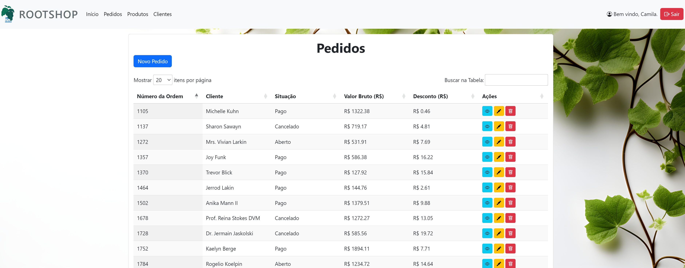

# Root Shop


Este é um projeto Fullstack usando PHP, onde utilizei as seguintes tecnologias para criar uma loja totalmente funcional:
- HTML, CSS e JS
- Bootstrap, Jquery e DataTable
- PHP e Laravel
- Docker
  


## Pré-requisitos para Uso

Certifique-se de que você tem as seguintes ferramentas instaladas em seu sistema:

- [Docker](https://www.docker.com/get-started)
- [Docker Compose](https://docs.docker.com/compose/install/)

## Passos para Configuração

1. **Clone o Repositório**

Faça um clone em sua máquina local.

```sh
git clone https://github.com/crcami/root-shop.git
cd root-shop
```

## Crie o Arquivo .env

Copie o arquivo Dockerfile, docker-compose e o .env-example para a raiz, sendo o .env ajustado para as suas configurações conforme necessário.

```sh
cp -f others/Dockerfile Dockerfile && cp -f others/docker-compose.yml docker-compose.yml && cp others/.env.example .env
```

## Construa os Contêineres Docker

Use o comando abaixo para construir os contêineres Docker:

```sh
docker-compose build
```

## Suba os Contêineres Docker

Use o comando abaixo para iniciar os contêineres Docker:

```sh
docker-compose up
```


## Acessando a Aplicação

Após seguir os passos acima, a aplicação estará disponível em http://localhost:8000.
